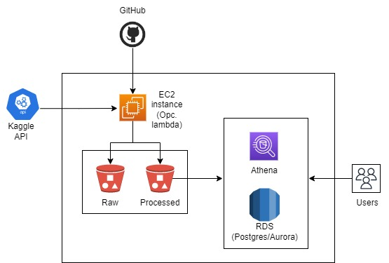

# nequi_de
## 1. Datasets
Las fuentes de los datos se toman de [Kaggle Datasets](https://www.kaggle.com/datasets "Kaggle Datasets") y son ingestados con el uso de la [API](https://www.kaggle.com/docs/api "Kaggle API") pública expuesta por Kaggle mediante el script `src/load_data.py` .
1. [Credit risk analysis](https://www.kaggle.com/datasets/ranadeep/credit-risk-dataset "CreditRisk")  
   Caso de uso: Análisis de mora, PD, uso, reportes de estado de cartera y/o cosechas  
   Requerimiento: acceso a datos en zona de data procesada  
   Formato: CSV
2. [Electric Motor Temperature](https://www.kaggle.com/datasets/wkirgsn/electric-motor-temperature "ElectrinMotorTemperature")  
   Caso de uso: Análisis de series de tiempo, pronóstico de fallas  
   Requerimiento: acceso a datos en zona de data procesada  
   Formato: CSV
3. [CiteSum](https://www.kaggle.com/datasets/nbroad/cite-sum "CiteSum")  
   Caso de uso: NLP (generacion automatica de resumenes), análisis de publicaciones y journals  
   Requerimiento: acceso a datos en zona de data procesada con tablas relacionadas  
   Formato: json

## 2. Exploración datos

Se realiza una exploración sencilla sobre los datos transformados a **Pandas DataFrames** con el uso del script `utils/eda.py` con el fin de generar reporte con estadísticas básicas sobre cada tabla incluyendo número de faltantes y tipo da dato por columna. Los reporte se ubican en la carpeta `profiling_reports` para cada tabla generada y lista para ser llevada a la zona processed (Diagrama de arquitectura).

## 3. Arquitectura

Se cuenta con dos zonas de almacenamiento utilizando particionamiento. En **Raw** los datos se almacenan con su estructura y formato original. En **Processed** se almacenan como tablas en formato parquet comprimido. De acuerdo al esquema original se generan tablas que conserven el relacionamiento en las tablas resultantes (ej. archivos json).

⚠️ Pendiente migrar la creación de infraestructura utilizando AWS cli en un archivo .sh . Opcion avanzada, con equipo DevOps terraformar la arquitectura de este y demás componentes adicionales orquestando la ejecución del proceso completo (infra, code test, ETL) con una herraminenta de CI/CD. 

## 4. Proceso

La ejecución del script `exececute_process.py` orquesta el flujo de los datos. La infraestructura se crea con el script `src/infra.py` que en este caso corresponde a la creación de un bucket en S3. A partir del **Processed** se podrán incoporar componentes para consultar la información con SQL.

Los scripts `scr/transform_*.py` realizan los procesos de estandarización posteriores a la revisión de los datos.  

⚠️ Validar credenciales API kaggle, AWS  
⚠️ Pendiente cerificar que la estructura del directorio este creada  
⚠️ Pendiente verificar que el bucket ya existe antes de crearlo

### Pruebas unitarias

⚠️ Pendiente dar mayor cobertura sobre las pruebas

Se utiliza Unittest

`python -m unittest discover -v`

## 5. Consideraciones finales

1. Desarrollar las ingestiones de las fuentes de datos al data lake  
   * Conservando su formato original
   * Transformar a un formato estandar
   * Almacenar con propósito de consulta ágil (Particionamiento y compresión)
2. Necesidad de los datos  
   No se asume necesidad de profundizar en el entendimiento particular de cada base. El ejercicio se dirije a la necesidad de almacenar las fuentes después de adelantar procesos de normalización y/o estandarización, permitiendo su fácil consulta a través de otras herramientas (ej. Athena).  
   Se suministra información descriptiva de cada tabla disponible (Profiling_reports).  
     
   Considerando el propósito del caso uso, los datos se disponibilizarán a partir de **processed** para adoptar el modelo que se ajuste:
      * Business intelligence - BI: Métricas, indicadores, KPI (Bases de datos relacionales, modelos estrella o snowflake, tablas de hechos y dimensiones)
      * Business analytics - BA: Entendimineto del cliente, interacción y comportamineto con la App, CLTV, segmentos, analítica digital (BD relacional)
      * Advanced analytics - AA: Exploración de datos crudos, integracion de multiples fuentes, desarrollo de bases para entrenamiento de modelos (Datos crudos o procesados, BD)

3. Modelo elegido
   * Tablas relacionales (para llevar a una BD)
   * Organización de las fuentes y conservación de los datos originales (Raw, processed)
   * Optimizar uso de recursos (particionamineto, compresion -> Consultas)
   * Facilitar la conexión con otras herramientas del proveedor de servicios en la nube

4. Aspectos de escalabilidad
   * Incremento 100X
      * Migrar a metodos de ingestion por streaming (AWS Kinesis Streams o Firhose, Kafka) [Alta frecuencia]
      * Ingestión a través de lambdas [Baja frecuencia]
      * Uso de glue jobs [Alto tamaño]
      * Consultas a través de RedShift [Gran volumen]
   * Frecuencia de ejecución ingestiones
      * Configurar contrab para ejecución de procesos
      * Utilizar un orquestador (para todo el flujo): Airflow, AWS step functions
   * Volumen número de consultas
      * Garantizar que las consultas sean eficientes (aka. optimizar con buenas prácticas)
      * Utilizar servicios que tengan escalibilidad (RedShift, EMR ) y que permitan incrementar el desempeño del motor
      * Utilizar servicios administrados por el proveedor de nube
   * ¿Real time o Near real time?
      de acuerdo al caso de uso:
      * Ingestiones
         * Lambdas con trigger en actualización de datos
         * Servicios streaming (Kinesis data analytics)
      * Procesamiento
         * Reemplazar EC2 con lambda
         * Kinesis analytics
   

